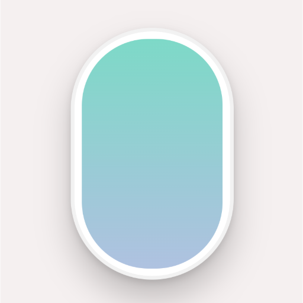

# TRAVELOGUE - 여행을 시작하는 순간의 설렘

## overview
여행의 설렘은 늘 출발 직전에 가장 선명해진다. 터미널의 공기, 게이트 앞의 기다림, "체크 인" 버튼을 누르는 손끝의 떨림. TRAVELOGUE는 그 순간을 한 페이지를 넘기듯 기록하고, 여행이 끝난 뒤에서 다시 꺼내볼 수 있도록 만들었다.
여행은 끝나면 사진만 남는다고들 하지만, 사진 속에 담겼던 온도는 생각보다 빨리 옅어진다. TRAVELOGUE는 사진보다 먼저 사라지는 그 온도를 붙잡기 위해 시작됐다. 

**여행의 기억을 "정보"가 아니라 "분위기"로 다시 불러오기 위해.**

TRAVELOGUE는 여행이 끝난 뒤에도 "출발 직전의 설렘"을 다시 꺼내볼 수 있도록 만든 프로젝트입니다. 터미널과 탑승권을 모티프로 한 UI흐름을 따라가며, 단순히 사진을 저장하는 것을 넘어 여행의 분위기와 감정선을 함께 기록하는 경험을 목표로 하였습니다.